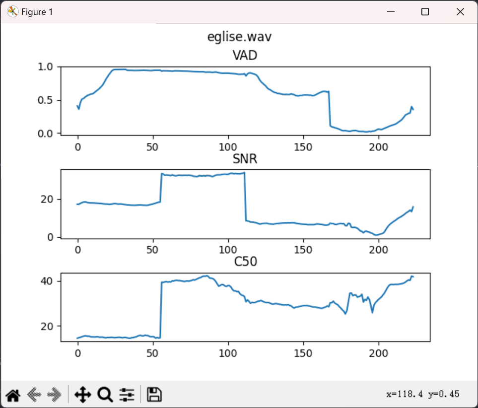

### Installation

```
# clone brouhaha
git clone https://github.com/marianne-m/brouhaha-vad.git
cd brouhaha-vad

# creating a conda environment
conda create -n brouhaha python=3.8
conda activate brouhaha

# install brouhaha
pip install .
```

Depending on the environment you're running the model in, it may be necessary to install libsndfile with the following command:
```
conda install -c conda-forge libsndfile
```


### Convert ckpt to onnx
```
run ckpt2onnx.ipynb
```


### Run onnx Inference with Python
```
python onnx_RT.py
```

### Extract predictions

```
python brouhaha/main.py apply --data_dir path/to/data --out_dir path/to/predictions --model_path models/best/checkpoints/best.ckpt --ext wav
```
